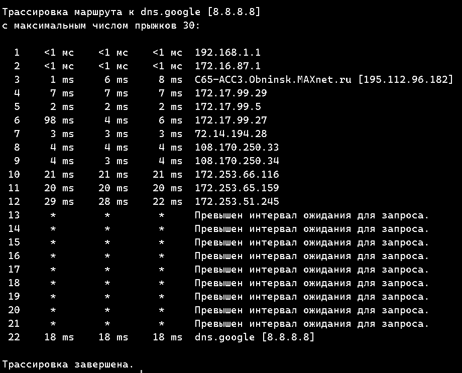
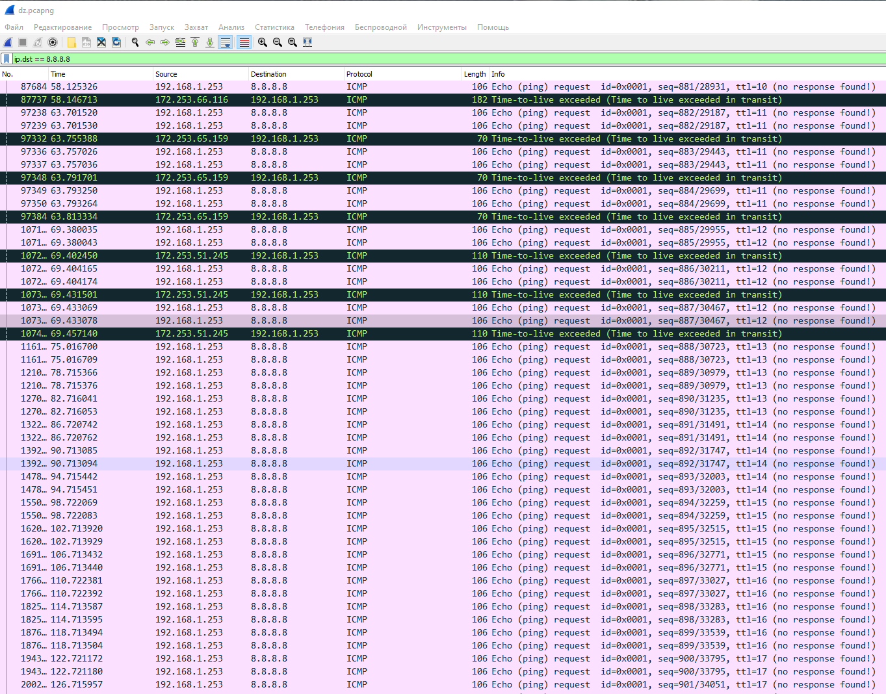
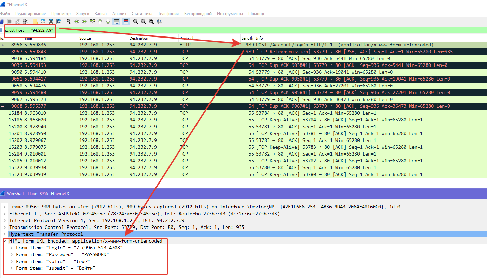

# Компьютерные сети (семинары)
## Урок 5. Основы компьютерных сетей. Транспортный уровень. UDP и TCP.

__Задание:__

1. В приложенном файле “The Ultimate PCAP.pcap” (из раздаточного материала) найти e-mail. Что внутри письма и для кого оно?
2. Закрепите навыки фильтрования. Запустите трейс до 8.8.8.8. И перехватите его в Wireshark. Проанализируйте.
3. Закрепите навыки фильтрования. Найдите еще один сайт без шифрования с возможностью ввода логина/пароля. (можно в гугл настроить соответствующую выдачу по запросу с ключом “-inurl:https” в конце). Перехватите их в Wiresharke, построив фильтр.

----
__Решение:__

1. 
> Subject: SMTP Ping 

> Content-Type: text/plain

> From: <>

> To: <johannes@webertest.net>

> AABBCCDDEEFFGGHHIIJJKKLLMMNNOOPPQQRRSSTTUUVVWWXXYYZZ00112233445566778899
AABBCCDDEEFFGGHHIIJJKKLLMMNNOOPPQQRRSSTTUUVVWWXXYYZZ00112233445566778899
AABBCCDDEEFFGGHHIIJJKKLLMMNNOOPPQQRRSSTTUUVVWWXXYYZZ00112233445566778899
AABBCCDDEEFFGGHHIIJJKKLLMMNNOOPPQQRRSSTTUUVVWWXXYYZZ00112233445566778899
AABBCCDDEEFFGGHHIIJJKKLLMMNNOOPPQQRRSSTTUUVVWWXXYYZZ00112233445566778899
AABBCCDDEEFFGGHHIIJJKKLLMMNNOOPPQQRRSSTTUUVVWWXXYYZZ00112233445566778899
AABBCCDDEEFFGGHHIIJJKKLLMMNNOOPPQQRRSSTTUUVVWWXXYYZZ00112233445566778899

2.

Wireshark отправляет пакеты по протоколу ICMP с посепенно увеличивающимся TTL от 1 до 30 (помечены розовым цветом). Роутеры по пути следования пакета отвечают что TTL истек и уничтожают его (помечены черным цветом). Роутеры в конце пути перестают отправлять ответные пакеты, просто уничтожают запросы с истекшим TTL.

3.

Для упражнения выбрал Саранский расчетный центр http://lc.irc-saransk.ru/

